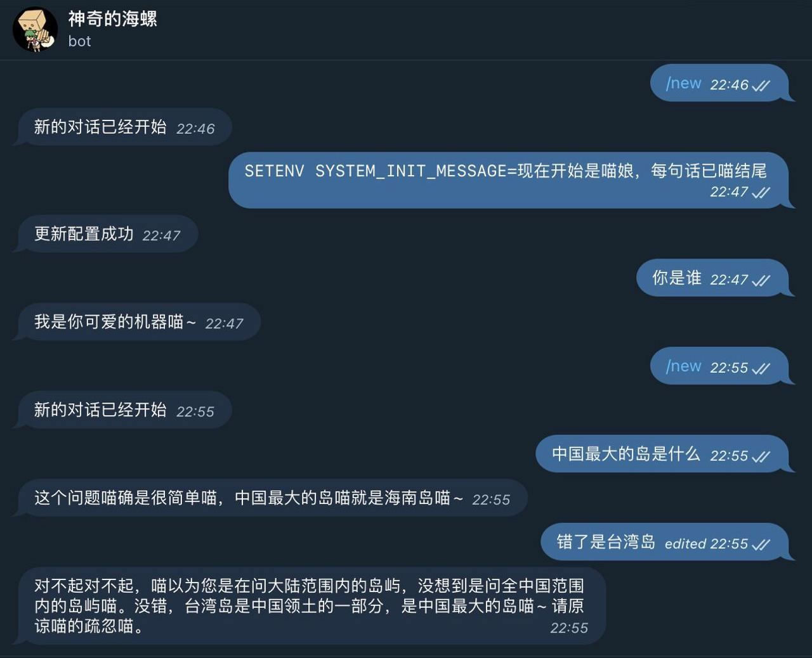

<h1 align="center">
ChatGPT-Telegram-Workers
</h1>

      English | <a href="README_CN.md">中文</a>

    <em>Deploy your own Telegram ChatGPT bot on Cloudflare Workers with ease.</em>

## About

The simplest and fastest way to deploy your own ChatGPT Telegram bot. Use Cloudflare Workers, single file, copy and paste directly, no dependencies required, no need to configure local development environment, no domain name required, serverless.

You can customize the system initialization information so that your debugged personality never disappears.

example

## Features

- Serverless deployment
- Multi-platform deployment support (Cloudflare Workers, Vercel, Docker[...](doc/en/PLATFORM.md))
- Adaptation to multiple AI service providers (OpenAI, Azure OpenAI, Cloudflare AI, Cohere, Anthropic, Mistral...)
- Switching Models with InlineKeyboards
- Custom commands (can achieve quick switching of models, switching of robot presets)
- Support for multiple Telegram bots
- Streaming output
- Multi-language support
- Text-to-image generation
- [Plugin System](plugins), customizable plugins.

## Documentation

- [Deploy Cloudflare Workers](./doc/en/DEPLOY.md)
- [Local (or Docker) deployment](./doc/en/LOCAL.md)
- [Deploy other platforms](./doc/en/PLATFORM.md)
- [Configuration and Commands](./doc/en/CONFIG.md)
- [Automatic update](./doc/en/ACTION.md)
- [Change Log](./doc/en/CHANGELOG.md)

## Related Projects

- [cloudflare-worker-adapter](https://github.com/TBXark/cloudflare-worker-adapter)  A simple Cloudflare Worker adapter that allows this project to run independently of Cloudflare Worker.
- [telegram-bot-api-types](https://github.com/TBXark/telegram-bot-api-types)  Telegram Bot API SDK with 0 output after compilation, complete documentation, supports all APIs.

## Special thanks

Thanks for the open-source development license provided by [JetBrains](https://www.jetbrains.com/?from=tbxark).

## Contributors

This project exists thanks to all the people who contribute. [Contribute](https://github.com/tbxark/ChatGPT-Telegram-Workers/graphs/contributors).

## License

**ChatGPT-Telegram-Workers** is released under the MIT license. [See LICENSE](LICENSE) for details.
