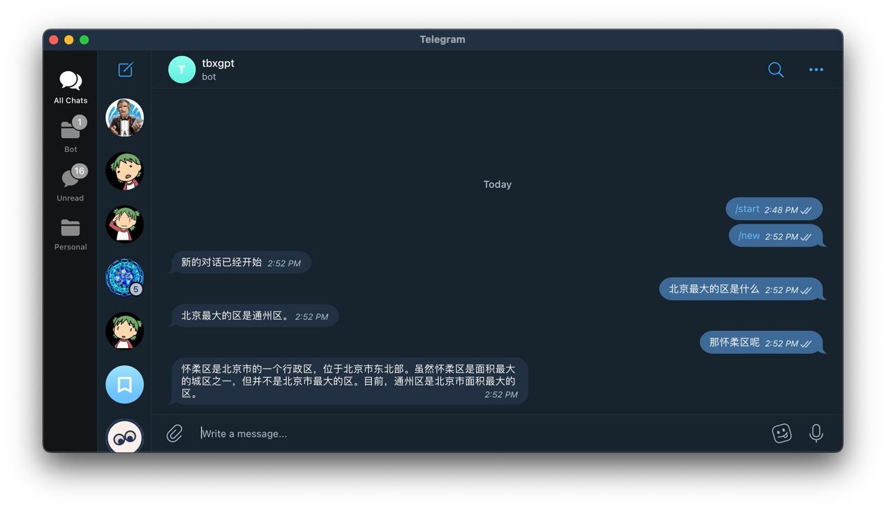

# ChatGPT-Telegram-Workers

The easiest and fastest way to deploy your own ChatGPT Telegram bot. Using Cloudflare Workers, it's a one-file solution that you can simply copy and paste without any dependencies, without configuring your local development environment, without a domain name, and without a server. You can customize the system initialization information so that your debugged personality never disappears.

## Branches
- [`master`](https://github.com/TBXark/ChatGPT-Telegram-Workers/tree/master) A version that has been tested and has almost no bugs.
- [`dev`](https://github.com/TBXark/ChatGPT-Telegram-Workers/tree/dev) A version with some new features, but has not been fully tested and is generally usable.

## Configuration

It is recommended to fill in environment variables in the Workers configuration interface instead of directly modifying variables in the JavaScript code.

#### System Configuration
Configuration that is common to each user, usually filled out in the Workers configuration interface.

|KEY|Description|Type|Special Notes|
|--|--|--|--|
|API_KEY|OpenAI API Key|Environment Variables||
|TELEGRAM_TOKEN|Telegram Bot Token|Environment Variables|Deprecated, provides compatibility code, and can be replaced by `TELEGRAM_AVAILABLE_TOKENS`.|
|TELEGRAM_AVAILABLE_TOKENS|Support for multiple Telegram Bot Tokens|Environment Variables|Multiple tokens separated by `,`|
|WORKERS_DOMAIN|Workers domain name|Environment Variables|Do not include `https://`|
|CHAT_WHITE_LIST|Chat ID whitelist|Environment Variables|Multiple IDs separated by `,`. If you don't know the ID, chat with the bot and it will return it to you.|
|I_AM_A_GENEROUS_PERSON|Turn off the whitelist and allow everyone to access|Environment Variables|Since many people do not want to set up a whitelist or do not know how to get the ID, this option allows everyone to access when its value is `true`.|
|AUTO_TRIM_HISTORY|Automatically trim the chat history|Environment Variables|To avoid the 4096 character limit, messages are truncated.|
|MAX_HISTORY_LENGTH|The maximum length of the chat history|Environment Variables|`AUTO_TRIM_HISTORY is enabled` To avoid the 4096 character limit, messages are truncated.|
|DEBUG_MODE|Debug mode|Environment Variables|Currently, the latest message can be saved to KV for debugging purposes.|
|DATABASE|KV data|KV Namespace Bindings|Create a new KV with any name, and then bind it to `DATABASE`.|

#### Group Configuration
You can add the bot to a group, and then everyone in the group can chat with the bot.

|KEY|Description|Type|Special Notes|
|--|--|--|--|
|GROUP_CHAT_BOT_ENABLE|Enable group chat bot|Environment Variables|After enabling, the bot will join the group, and then everyone in the group can chat with the bot.|
|BOT_NAME|Bot name xxx_bot|Environment Variables|Deprecated, provides compatibility code, and can be replaced by `TELEGRAM_BOT_NAME`.|
|TELEGRAM_BOT_NAME|Bot name xxx_bot|Environment Variables|The order must be consistent with `TELEGRAM_AVAILABLE_TOKENS`.|
|GROUP_CHAT_BOT_SHARE_MODE|Group chat bot shares chat history|Environment Variables|After enabling, the group has only one session and configuration. If disabled, each person in the group has their own conversation context.|

#### User Configuration
Custom configuration for each user can only be modified by sending a message to the bot on Telegram. The message format is `/setenv KEY=VALUE`.
|KEY|Description|Example|
|--|--|--|
|SYSTEM_INIT_MESSAGE|System initialization parameters, even if a new session is started, they will be retained and don't need to be debugged every time.|/setenv SYSTEM_INIT_MESSAGE=Now it's Meow, with every sentence ending with "meow"|
|OPENAI_API_EXTRA_PARAMS|Additional OpenAI API parameters, which will be included with each API call, can be used to adjust temperature and other parameters.|/setenv OPENAI_API_EXTRA_PARAMS={"temperature": 0.5} Every modification must be a complete JSON.|

## Deployment process
See [Deployment Process](./DEPLOY_EN.md) for details.

## Best Practices
Create multiple bots and bind them to the same workers, set `TELEGRAM_AVAILABLE_TOKENS`, and assign each bot a different `SYSTEM_INIT_MESSAGE`. For example, translation experts, copywriting experts, and code experts. Then chat with each bot according to your needs and different requirements, so you don't have to switch configuration properties frequently.

## Update Log
- v1.1.0
    - Changed from a single-file to a multi-file solution for easier maintenance, provided a `dist` directory for easy copy and paste.
    - Deleted newly added configuration and provided compatibility code for easy upgrading.
    - Changed the KV key generation logic
    - Automatically bind all commands to the bot