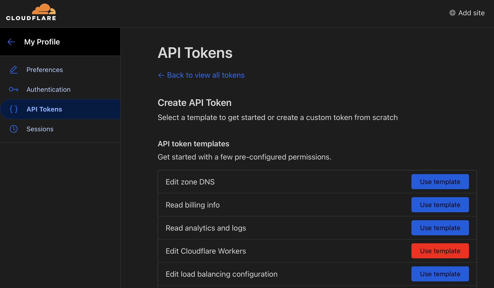
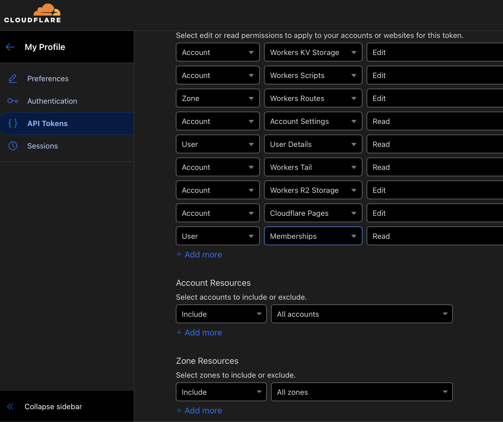

# How to start with AiGram?

> Just open https://telegram.onout.org and go to a step 2 (Create Cloudflare API token) if you don't need or want to install backend

## 1. Backend installation

### 1.1 Setup backend on your AWS cloud

1. Sign up to aws.amazon.com and go to AMI Catalog
2. Find ami-019a0836953fe72f3 (in "community ami") -> select -> run instance
3. Run instance based on this AMI (no keypair, allow http port)
4. (optional) Go to AWS->EC2->instances. You should see running instance, connect to it using a "connect" button:
   
5. (optional) run command ```cd ChatGPT-Telegram-Workers/ && git pull``` to update to the latest version 👍
6. Open http://54.157.243.154/ where 54.157.243.154 is your "public IPv4" address (see screnshot above) (check you open http version, not https). You should see the deploy form

(optional) Add a domain to your server

1. Add your domain to cloudflare.com and add subdomain "telegram.your-domain.com" (in the "DNS" section) linked to the IP you've got from amazon ("public IP of your instance"). Enable orange cloud, enable SSL -> flexible SSL
2. Open telegram.your-domain.com in browser and follow the instructions

### 1.2 Setup backend on VPS (alternative to AWS)

1. Setup on your server
   Install Node.js first (at list 18 version): Node.js site.
   Run these commands in the terminal:

```bash
git clone https://github.com/noxonsu/ChatGPT-Telegram-Workers.git
cd ChatGPT-Telegram-Workers
npm i
npm install pm2 -g
pm2 start ai2telegramservice.cjs
```

Finally open a deployment page: http://<Your IP>:3006

### 2. Get information for Cloudflare API

To be able to use Cloudflare.com API you need to get API token and your accour ID. Follow these steps to do so:

2.1. Log in to your Cloudflare.com account. Or create a new account.
2.2. Select "API Tokens" from the left-hand menu.
2.3. Click the "Create Token" button.
2.4. Choose "Edit Cloudflare Workers" from the API token templates:

2.5. In the "Zone Resources" dropdown menu, select the domain you want to authorize.
2.6. In the "Account Resources" dropdown menu, select the account you want to authorize.
2.7. Click the "Create Token" button.

You have now created a Cloudflare API Token with Workers permissions. Remember, API Token security is very important. Do not share it unnecessarily and change your API Token regularly.

### 3. Get OpenAI API key

3.1 Go to OpenAI: https://platform.openai.com
3.2 Register a new account. After that in a top right corner, press on your account zone and select a "View API keys" button
3.3 Press a "+ Create new secret key" button. Enter any name, press "Create" and wait for creation. In the end do not forget to copy your new key, you won't see it again! Save it in a safe place and do not share with anybody.

### 4. Get bot API key from the @BotFather

4.1 Open a BotFather bot: t.me/BotFather
4.2 Start the bot (or select /newbot in the menu) and follow the instuctions
4.3 In the end copy your bot key

### 5. Open deploy form and activate using your license


Do not have a license for AiGram? Get it here: https://dash.onout.org