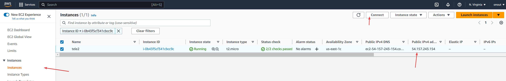
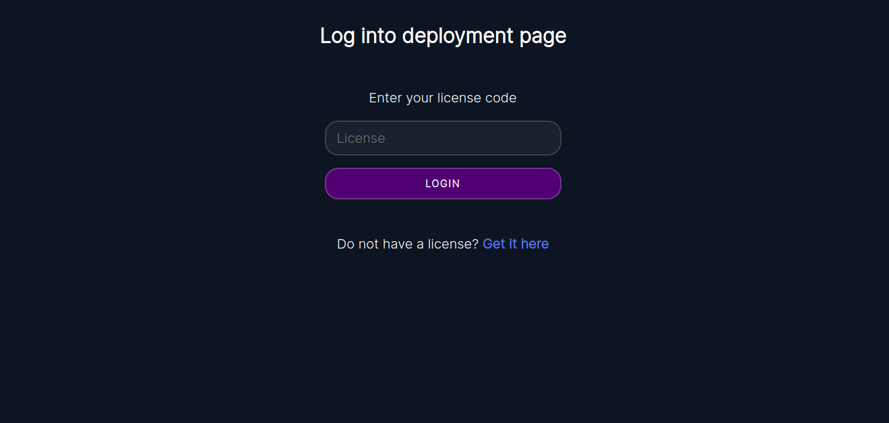

# How to start with Sensorica?

> Just open https://telegram.onout.org and go to a step 2 (Create Cloudflare API token) if you don't need or want to install backend.

## 1. Backend installation

### 1.1 Setup backend on your AWS cloud

1. Sign up to aws.amazon.com and go to AMI Catalog
2. Find `ami-019a0836953fe72f3` (in "community ami") -> Select -> Run instance
3. Run instance based on this AMI (no keypair, allow http port)
4. **(optional)** Go to AWS -> EC2 -> Instances. You should see running instance, connect to it using a "Connect" button:
   
5. **(optional, but important)** Run command ```cd ChatGPT-Telegram-Workers/ && git pull``` to update to the latest version 👍. If you don't
    have Git, install it first: [Installing](https://git-scm.com/book/en/v2/Getting-Started-Installing-Git) 
6. Open http://54.157.243.154/ where *54.157.243.154* is your "public IPv4" address (see screenshot above). Check that you open **http** version, not **https**.
   You should see the deployment form

**(optional)** Add a domain to your server

1. Add your domain to Cloudflare and add a subdomain `telegram.<your-domain>.com` (in the "DNS" section) linked to the IP you've got from Amazon ("public IP of your instance").
   Enable orange cloud: Enable SSL -> Flexible SSL
2. Open `telegram.<your-domain>.com` in browser and follow the instructions

### 1.2 Setup backend on VPS (alternative to AWS)

1. Setup on your server. Install Node.js first (at list 18 version): [Node.js site](https://nodejs.org/en). We recommend that you use LTS. 
   Run these commands in the terminal:

```bash
git clone https://github.com/noxonsu/ChatGPT-Telegram-Workers.git
cd ChatGPT-Telegram-Workers
npm i
npm install pm2 -g
pm2 start server/index.js
```

Finally open locally `http://<Your IP>:3006`

### 2. Get information for Cloudflare API

To be able to use Cloudflare.com API you need to get an API token and an account ID. Follow these steps to do so:

2.1. Log in to your Cloudflare account or create a new one: [Cloudflare dashboard](https://dash.cloudflare.com/)
2.2. Copy this ID from the browser URL. Like on this picture:


2.3. In the top right corner select "My Profile" in the menu
2.4. Select "API Tokens" from the left-hand menu.
2.5 Click the "Create Token" button:


2.6. Choose "Edit Cloudflare Workers" from the API token templates:


2.7. For the "Account Resources" dropdown select All accounts. For the "Zone Resources" select All zones:


2.8. In the end of the page click on the "Continue to summary" button. Finally, press the "Create token" button.

> ! DO NOT FORGET TO SAVE THE TOKEN! It's only visible once !

You have now created a Cloudflare API Token with Workers permissions. Remember, API Token security is very important. Do not share it unnecessarily.

### 3. Get OpenAI API key

3.1 Go to OpenAI: https://platform.openai.com
3.2 Register a new account. After that in a top right corner, press on your account zone and select a "View API keys" button
3.3 Press a "+ Create new secret key" button. Enter any name, press "Create" and wait for creation. In the end do not forget to copy your new key, you won't see it again! Save it in a safe place and do not share with anybody.

### 4. Get bot API key from the @BotFather

4.1 Open a BotFather bot: t.me/BotFather
4.2 Start the bot (or select /newbot in the menu) and follow the instuctions
4.3 In the end copy your bot key

### 5. Open deploy form and activate using your license



Do not have a license for AiGram? Get it here: https://dash.onout.org
